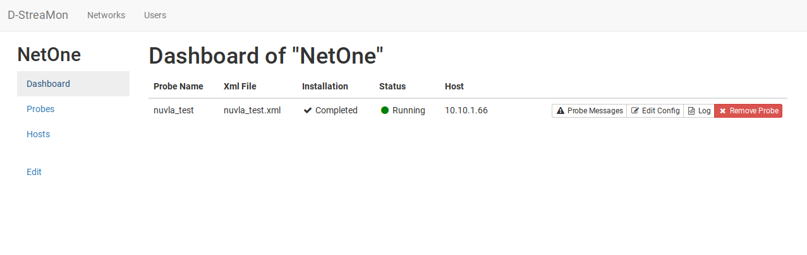

# D-StreaMon

A Distributed Framework for Network Monitoring



## Description

Distributed StreaMon (D-StreaMon) is an orchestration
framework for distributed monitoring on NFV network
architectures. It relies on the StreaMon platform, a solution
for network monitoring originally designed for traditional
middleboxes.

## Vagrant quickstart

### Run Master

```
cd d-streamon/vagrant/master

vagrant up

...(wait installation)...

vagrant ssh

cd d-streamon/bin
```

To launch the server
```
node server.js
```

To launch the server in the background
```
./runBg.sh
```

### Run Slave

In the vagrant file, you can launch up to 4 slave machines called slave1, slave2, slave3, slave4.

To launch a single machine, for example slave3
```
cd d-streamon/vagrant/slaves

vagrant up slave3
```
To launch all four
```
vagrant up
```

## Network informations

The master machine and the slave machines have two network interfaces, one for outbound and one used to create an internal network between the master machine and slave machines.

Network data:

| Variable Name | Description            | Value                           |
| ------------- | ---------------------- | ------------------------------- |
| PORT          | Web Port               | `9999`                          |
| Master IP     | Internal IP            | `10.0.0.100`                    |
| Slave1 IP     | Internal IP            | `10.0.0.101`                    |
| Slave2 IP     | Internal IP            | `10.0.0.102`                    |
| Slave3 IP     | Internal IP            | `10.0.0.103`                    |
| Slave4 IP     | Internal IP            | `10.0.0.104`                    |
